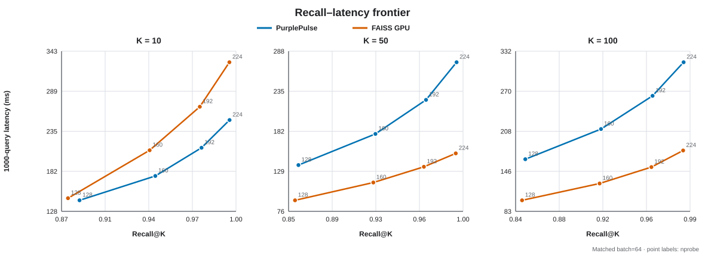
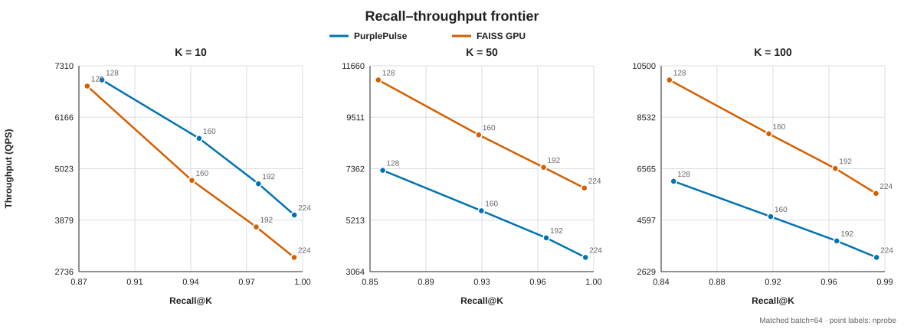
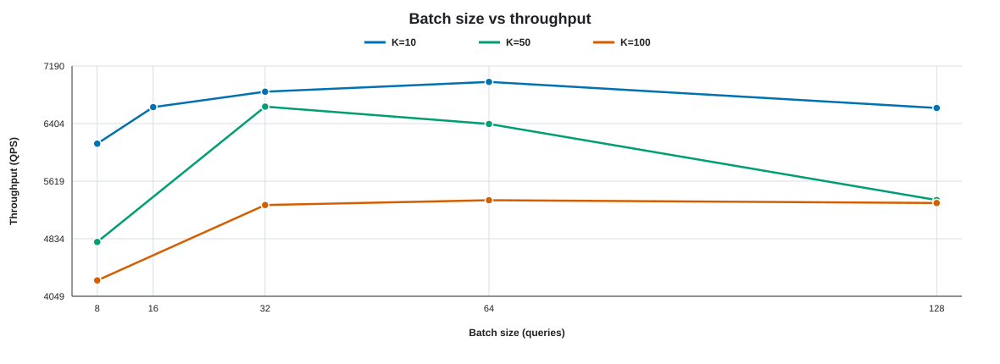

# PurplePulse GPU 向量检索引擎总结报告

## 1. 项目结论

PurplePulse 已完成一个从正确性 baseline 演进而来的自研 GPU 向量检索引擎。
系统支持 FP32/FP16、L2/内积/Cosine、K≤100、批量查询、精确检索和
IVF-Flat，并实现了 GPU 常驻索引、中心选择、桶扫描、局部 Top-K 与最终归并。

项目的主要结论是：GPU 检索性能不能只依赖距离计算；数据布局、候选选择、
Top-K 状态大小、批量并行度以及过滤发生的位置共同决定最终吞吐。优化后的
PurplePulse IVF K=10 在百万规模高召回区优于同口径 FAISS GPU IVF；100 次
持续采样的平衡档中，K=50/100 仍落后约 1.57×/1.67×。Agent 记忆场景中，
在候选扫描内融合过滤和评分，相比语义 Top-100 后独立重排实现了约 2.23×
吞吐，并避免了先截断造成的明显结果损失。Exact 路径也已将距离计算与
局部 Top-K 融合，百万规模 K=10/50/100 相对完整距离矩阵路径分别提升约
3.13×/7.16×/10.59×。

## 2. 范围与功能

已完成：

- 版本化向量库、查询集、IVF 索引和 Agent 记忆元数据格式。
- CPU 精确检索与 CPU IVF-Flat 正确性参考。
- GPU 精确检索、GPU Top-K、融合距离/局部选择和常驻显存工作区。
- 确定性采样 k-means、球面 k-means、连续倒排桶和索引持久化。
- GPU 中心选择、probe 扫描、K=10/50/100 模板化 heap 与 k-way merge。
- FP16 存储、FP32 累加和 L2/IP/Cosine 编译期特化。
- 固定与 score-mass 自适应 nprobe、masked/grouped 调度 A/B。
- Agent 记忆时间戳、重要性、会话/来源过滤、fused/rerank A/B。
- QPS、run/batch P50/P99 及样本数、显存、recall、平均/最大分数误差与
  原始 CSV 记录。

IVF-PQ、完整 RAG、分片部署和其他 GPU 平台适配是扩展项，不属于本次核心
交付。

## 3. 系统结构

检索热路径如下：

```text
queries H2D
    │
    ▼
GPU center scoring ──► block-parallel probe selection
    │
    ▼
selected IVF buckets
    │
    ├─ standard IVF: warp-cooperative distance + per-probe Top-K
    │
    └─ memory fused: metadata filter + distance + memory score + Top-K
    │
    ▼
ordered per-probe lists ──► k-way merge ──► Top-K D2H
```

Exact 热路径不经过 IVF 中心和桶选择：warp 协作计算距离时直接维护局部
Top-K，每个 query/chunk 只输出 K 个候选，最后进行一次小规模归并。因此
不再生成 `batch_size × num_vectors` 的完整距离矩阵。

索引向量按桶连续存放，`offsets` 定位桶区间，`ids` 保留原始向量 ID。记忆
元数据按原始 ID 排列，因此桶扫描可以用 `ids[position]` 直接访问元数据，
不需要复制或重写索引。

### 3.1 距离与排序语义

- L2 输出平方距离，分数越小越好。
- Inner Product 和 Cosine 输出相似度，分数越大越好。
- FP16 输入在 GPU 上保持 16 位存储，加载后使用 FP32 累加。
- 相同分数使用较小向量 ID 作为稳定 tie-break。

### 3.2 Agent 记忆评分

设语义分数为 `s`，重要性为 `i∈[0,1]`，当前时间为 `t_now`，记忆时间为
`t`，时间尺度为 `τ`：

```text
recency = exp(-max(0, t_now - t) / τ)
boost   = w_importance × i + w_recency × recency
```

对 IP/Cosine，最终分数为 `w_semantic × s + boost`；对 L2，最终分数为
`w_semantic × s - boost`，从而保持原 metric 的排序方向。时间、会话和来源
过滤在读取向量前执行；如果过滤后不足 K 条，系统返回实际数量。

## 4. CUDA 优化过程

精确检索首先暴露出单线程 GPU Top-K 比距离计算更慢的问题。之后依次完成：

1. block 协作 Top-K 和两阶段候选归并；
2. 无序局部候选与最差项跟踪；
3. warp 协作连续维度读取与 shuffle 归约；
4. 数据库和工作区常驻，区分初始化与稳定查询；
5. Exact 距离计算与局部 heap 融合，删除完整距离矩阵；
6. 根据 batch 调整 query/chunk 块数，控制并发度和中间候选数量；
7. IVF 中心选择、桶 offsets、候选扫描全部迁入 GPU；
8. metric 编译期特化，删除无效归约；
9. query 共享内存缓存；
10. 大 K 使用 compact 2-warp heap，减小共享内存状态；
11. 每个 probe 输出有序列表，最终使用 k-way merge；
12. 元数据过滤和记忆评分融合进桶扫描。

核心路径相对第二轮 IVF 基线，K10/K50/K100 推荐配置吞吐分别提升约
46.8%/72.1%/72.7%。优化没有改变候选 ID；浮点差异只来自并行归约顺序。

## 5. 正确性与安全性

自动测试覆盖：

- FP32/FP16 × L2/IP/Cosine。
- K=1/10/50/100。
- Exact simple/block/two-stage/fused 路径及完整矩阵与 fused 结果一致性。
- scalar、warp2/4/8、warp_compact。
- IVF 索引保存/加载和 `nprobe=nlist` 对 exact 的一致性。
- 自适应 nprobe 边界与 masked/grouped 结果一致性。
- 记忆 fused/rerank 的 CPU/GPU 对照、元数据过滤和不足 K 的空结果。
- 损坏文件、非法参数、数据长度不一致等失败路径。

2026-09-04 在 RTX 4090 D/CUDA 12.8 环境重新执行全量 CTest，7/7 通过。
Exact fused 的 K=10/50/100 百万规模 A/B
候选集合一致，记录的最大分数误差为 0；记忆检索 20k 端到端对照的 Top-K
集合一致，最大分数误差为 `7.6e-6`。`compute-sanitizer --tool memcheck`
重新执行后报告 0 errors。环境和原始文本日志见
[`REPRODUCIBILITY.md`](REPRODUCIBILITY.md) 与 `../evidence/2026-09-04/`。

## 6. 正式实验口径

主要 IVF 实验固定：1,000,000 个 FP32 向量、128 维、1000 queries、
inner-product、数据随机种子 2026、nlist=256、100,000 个训练样本、15 次
迭代。GPU 稳定查询预热 5 次、重复 100 次，每项采集 1600 个 batch 延迟
样本；单线程 CPU Flat 重复 20 次，采集 320 个 batch 样本。

PurplePulse 使用确定性等间距训练采样且没有训练 seed；FAISS 使用随机种子
2026 无放回抽样。FAISS 版本为 1.14.1 GPU，使用同一数据、K、nlist、
nprobe 和训练预算，但自行训练中心。因此比较的是相同预算下实际达到的
质量—性能，而不是强制扫描相同桶。数据和两类索引的校验和见复现记录。

下列质量曲线统一使用 batch=64，以保持 PurplePulse 与 FAISS 的比较口径一致。





### 6.1 nprobe=160 平衡档

| K | PurplePulse QPS / recall | FAISS GPU QPS / recall | 结论 |
|---:|---:|---:|---|
| 10 | 5697 / 0.9409 | 4763 / 0.9369 | PurplePulse 约快 1.20× |
| 50 | 5605 / 0.9248 | 8776 / 0.9231 | FAISS 约快 1.57× |
| 100 | 4733 / 0.9176 | 7899 / 0.9163 | FAISS 约快 1.67× |

在 nprobe=224 的近精确档，三种 K 的 recall 均约为 0.989–0.993；K10
PurplePulse 约快 1.31×，K50/K100 则由 FAISS 领先约 1.79×/1.77×。

平衡档的误差和尾延迟如下。分数误差按名次比较近似与 Exact Top-K，batch
P99 包含 query H2D、所有检索 kernel 和结果 D2H：

| K | PurplePulse mean score error / batch P99 | FAISS mean score error / batch P99 |
|---:|---:|---:|
| 10 | 0.04243 / 11.117 ms | 0.04627 / 14.627 ms |
| 50 | 0.05819 / 11.426 ms | 0.06007 / 11.372 ms |
| 100 | 0.06745 / 13.574 ms | 0.06908 / 8.197 ms |

原始数据位于 `results/formal_100k15/ivf_k{10,50,100}.csv` 和
`results/formal_100k15/faiss_gpu.csv`。

### 6.2 CPU Exact 加速比

为避免把不同 metric 或旧配置混在一起，以下三列都使用本轮百万规模 FP32
inner-product 数据、1000 queries、K 与 batch=64。CPU Exact 是 FAISS Flat
单线程；两种 GPU Flat 都与 PurplePulse Exact 的候选 ID 完全一致：

| K | CPU Exact QPS | PurplePulse Exact QPS / CPU 加速 | FAISS GPU Flat QPS / CPU 加速 |
|---:|---:|---:|---:|
| 10 | 76.45 | 6677.57 / 87.34× | 21226.30 / 277.64× |
| 50 | 76.45 | 5974.19 / 78.15× | 20745.80 / 271.37× |
| 100 | 73.55 | 5406.40 / 73.51× | 20038.59 / 272.45× |

FAISS Flat 相对 PurplePulse Exact 快 3.18–3.71×，说明自研 Exact 虽已完成
融合选择，但仍有明显优化空间。FAISS 与 PurplePulse Exact 的平均绝对分数
误差约为 `1.9e-6`，最大为 `1.15e-5`，来自 FP32 归约差异。

### 6.3 Batch 扫描



本节是旧 50k/8 索引上的辅助调参实验，不作为上面的 100k/15 正式对照。
K10 在 batch=64 达到约 6973 QPS；K50 在 batch=32 达到约 6636 QPS；
K100 在 batch=64 达到约 5359 QPS。batch 继续增大不一定提高吞吐，因为
工作区、局部 heap 状态和单批尾延迟也随之增加。

### 6.4 Exact 距离—选择融合

Exact 正式实验使用 1,000,000 个 FP32 向量、128 维、1000 queries、Cosine、
batch=64，预热 1 次并重复 5 次。matrix 为原来的 warp 距离矩阵加
two-stage/block Top-K；fused 在距离计算时维护局部 heap，只写出 chunk Top-K。

| K | matrix QPS | fused QPS | 加速 | matrix / fused 缓冲区 |
|---:|---:|---:|---:|---:|
| 10 | 1775.10 | 5563.72 | 3.13× | 734.34 / 488.44 MiB |
| 50 | 715.87 | 5123.32 | 7.16× | 732.49 / 488.94 MiB |
| 100 | 443.78 | 4700.80 | 10.59× | 732.53 / 489.56 MiB |

融合路径将常驻查询延迟分别降低 68.1%/86.0%/90.6%，显式 GPU 缓冲区降低
约 33%。随着 K 增大，旧 block Top-K 需要反复扫描百万项距离矩阵，而 fused
最终只归并 `chunks × K` 个候选，因此大 K 收益更明显。原始结果位于
`results/exact_fused/million_compare.csv`。

## 7. 创新实验

### 7.1 score-mass 自适应 nprobe

系统根据排序后的中心分数质量，为每个 query 选择 probe 前缀，并记录实际
nprobe。masked 与 grouped 输出一致；grouped 在 K100 上慢约 11.3%，原因是
多个小 kernel 网格降低并行度并增加 launch 开销。

平均 151.632 probes 与固定 152 probes 公平比较时，自适应策略在
K10/K50/K100 上分别慢约 1.0%/2.6%/3.6%，recall 也分别低约
0.0011/0.0013/0.0019。结论是中心分数能弱识别困难查询，但当前均匀合成
数据不足以抵消不规则调度成本，因此保留实验接口，不替换固定策略默认值。

### 7.2 GPU 元数据融合

记忆实验固定 100k×128、1000 queries、Cosine、nlist/nprobe=64/64、K=10、
batch=64、source_type=1。fused 扫描完整候选；rerank 先取语义 Top-100。

| 模式 | QPS | batch P99 | 显式 GPU 缓冲区 | recall@10 vs fused |
|---|---:|---:|---:|---:|
| fused | 48042.6 | 1.291 ms | 52.07 MiB | 1.000 |
| rerank Top-100 | 21573.2 | 2.964 ms | 56.35 MiB | 0.507 |

fused 约快 2.23×，且所有输出均满足来源过滤。独立重排在过滤和加权前已经
截断候选，无法恢复被丢弃的近期或高重要性记忆。这一结果同时支持“融合能
减少额外选择成本”和“过滤应尽早发生”两个系统设计结论。

## 8. Profiling 证据与限制

nsys 已用于记录 Top-K 优化前后的 kernel 时间线，分段计时也持续记录中心
选择、桶扫描、merge、独立 rerank 和 D2H。实验证明大 K 的主要瓶颈在桶内
候选选择，而不是中心选择或最终 merge。

本项目使用赛事方提供的托管 GPU 平台。Nsight Compute CLI 已经安装，能够
连接并执行目标程序，但采集硬件计数器时稳定返回：

```text
ERR_NVGPUCTRPERM - The user does not have permission to access
NVIDIA GPU Performance Counters on the target device.
```

进一步检查确认，这不是项目代码或 ncu 安装问题：任务运行在 Docker 容器中，
宿主 NVIDIA 驱动报告 `RmProfilingAdminOnly: 1`，而容器 capability bounding
set 不包含 `CAP_SYS_ADMIN` 或 `CAP_PERFMON`。容器内虽然使用 root 用户，
但容器 root 不具备宿主机管理员权限。解除限制需要赛事平台重新创建容器并
增加 profiling capability，或者修改宿主驱动参数并重载驱动；参赛者在当前
平台界面和 SSH 容器内均无法执行这两类宿主级操作。因此 ncu 硬件计数器被
归类为赛事平台权限限制，而不是尚未实现的项目功能。

该限制不影响 kernel 执行、结果正确性、CUDA Event 分段计时、nsys 时间线、
QPS、P50/P99 或显存统计。项目使用全量正确性测试、Compute Sanitizer、nsys、
稳定重复运行和逐项 A/B CSV 支撑性能结论；报告不推测 DRAM throughput、
achieved occupancy、cache hit rate 或 warp stall 等未实际采集的数据。如果
赛事平台后续开放计数器权限，可直接复用正式配置补采：

- achieved occupancy、active warps、registers/thread；
- DRAM/L2 throughput 与 load efficiency；
- warp stall reasons；
- fused 与 rerank 桶扫描 kernel 的指令和内存差异。

## 9. 复现

```bash
export PATH=/usr/local/cuda/bin:$PATH
cmake -S . -B build -G Ninja -DCMAKE_BUILD_TYPE=Release \
  -DCMAKE_CUDA_ARCHITECTURES=native
cmake --build build
ctest --test-dir build --output-on-failure
```

重新生成图表：

```bash
python3 scripts/plot_results.py \
  --results-dir results/formal_100k15 \
  --batch-results-dir results/million \
  --output-dir results/figures
```

数据、索引校验和、正式命令、延迟边界和原始证据索引见
[`REPRODUCIBILITY.md`](REPRODUCIBILITY.md)。

记忆融合与重排 A/B：

```bash
python3 scripts/benchmark_memory_modes.py \
  --search-binary ./build/ivf_search \
  --index data/memory_100k/cosine_nlist64.ivf \
  --queries data/memory_100k/cosine_q.bin \
  --params configs/ivf_flat_memory_fused.conf \
  --memory-metadata data/memory_100k/metadata.bin \
  --output-dir results/memory_100k/source1 \
  --csv results/memory_100k/source1_compare.csv \
  --nlist 64 --nprobe 64 --rerank-factor 10 \
  --source-type 1 --warmup 2 --repeat 5
```

Exact 完整矩阵与 fused A/B：

```bash
python3 scripts/benchmark_exact_fused.py \
  --search-binary ./build/vector_search \
  --database data/exact_million/cosine_db.bin \
  --queries data/exact_million/cosine_q.bin \
  --baseline-configs configs/exact_l2_batch64.conf,configs/exact_million_k50_batch64.conf,configs/exact_million_k100_batch64.conf \
  --fused-configs configs/exact_million_k10_fused_batch64.conf,configs/exact_million_k50_fused_batch64.conf,configs/exact_million_k100_fused_batch64.conf \
  --output-dir results/exact_fused/million_outputs \
  --csv results/exact_fused/million_compare.csv \
  --warmup 1 --repeat 5
```

所有性能结论都应从原始 CSV 重新计算。切换数据分布、GPU 或 CUDA 版本后，
需要重新扫描 batch/nprobe，不能直接沿用本报告中的最优参数。

## 10. 局限与后续工作

- Exact fused 的 chunk 数采用通用占用率启发式；更换数据规模、batch 或 GPU
  后仍需重新扫参，而不是假定当前配置始终最优。
- K50/K100 的每-probe heap 仍是 IVF 主瓶颈，可探索 radix/select 或跨 probe
  的 query 复用。
- 自适应 nprobe 只在均匀合成查询上得到负结果，需要异质真实查询复验。
- 记忆实验使用合成向量和元数据，真实 Agent 记忆分布仍需外部数据验证。
- ncu 指标受赛事方托管 GPU 平台的宿主权限限制；原因、影响范围和替代证据
  已在第 8 节完整记录。

## 11. 最终评价

项目已经达到“功能正确、性能可测、优化可解释、负结果可复现”的核心目标。
最有价值的产出不仅是某个 QPS 数字，而是一条有证据的工程演进路径：从 CPU
参考和简单 CUDA baseline 出发，通过 profiling 定位瓶颈，再用数据布局、
warp 协作、受控 Top-K 状态与计算融合逐步改进。对尚未超过 FAISS 的路径和
无法采集的指标均保留清晰边界，没有用推测替代实验。
